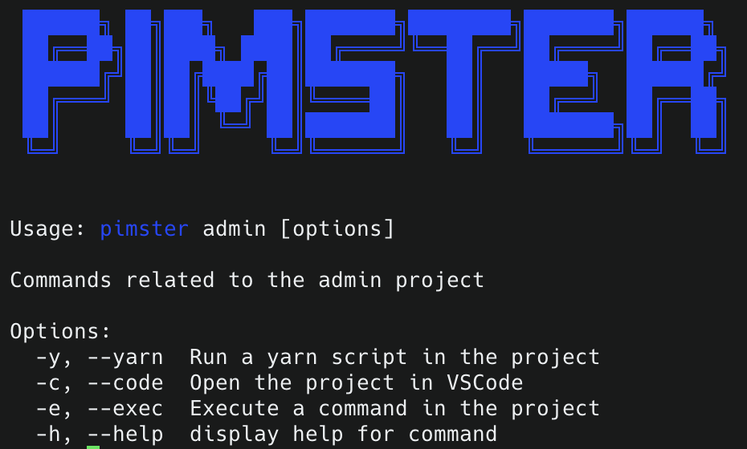

# pimster-cli

Our ultra cool cli for pimster projects.

(This is an early release)


## Installation

```bash
yarn global add @pimstar/pimster-cli --prefix /usr/local
```

## Setup Config

1 - Create a folder `pimster` in your home directory.

```bash
mkdir ~/pimster
```

2 - Clone the repositories you want to work on in the `~/pimster` folder.
Here is an example with the `pimster-pim` repository where you need to replace with the SSH url.

```bash
cd ~/pimster
git clone REPLACE_WITH_SSH_URL
```

3 - We have the projects cloned, now we need to create a `pimster.config.json` file in your `~/` directory.

```bash
touch ~/pimster.config.json
```

4 - Add the following content to the `pimster.config.json` file.

```json
{
	"projects": [
		{
			"name": "admin",
			"path": "~/pimster/pimster-admin"
		},
		{
			"name": "pim",
			"path": "~/pimster/pimster-pim"
		}
	],
	"database": {
		"production": {
			"name": "YOUR_DB_NAME",
			"username": "YOUR_DB_USERNAME",
			"host": "YOUR_DB_HOST",
			"password": "YOUR_DB_PWD"
		}
	}
}
```

5 - Reload your terminal and you should be able to run the `pimster` command.

## Some commands to run

To get some help:

```bash
pimster --help
pimster pim --help
```



To execute a yarn command in pimster project:

```bash
pimster pim -y dev
```

To open a pimster project in VSCode:

```bash
pimster admin -c
```

To interact with pimster psql database:

```bash
pimster db
```
